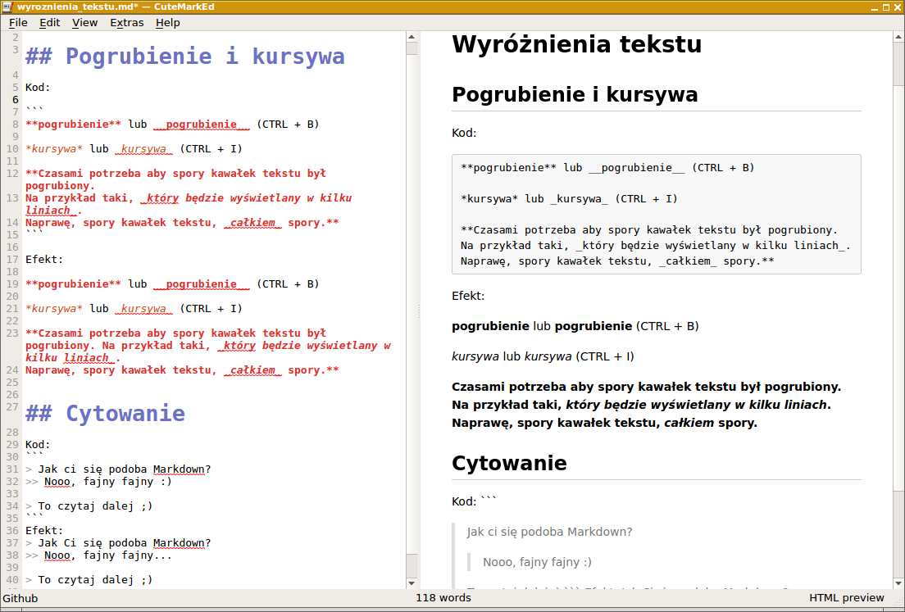

Poznaj Markdown
========

**Markdown** jest to język znaczników przeznaczony do formatowania tekstu. Powstał w celu maksymalnego uproszczenia tworzenia i formatowania tekstu.
Markdown to format czysto tekstowy, można go łatwo konwertować do **HTML**. A także **pdf**, **epub** czy **mobi**.

Dzięki temu opracowaniu nauczysz się jak pisać dokumenty wykorzystując składnię markdown.

Obrazek 1: Przykład tekstu markdown wraz z wyrenderowanym dokumentem po prawej.

